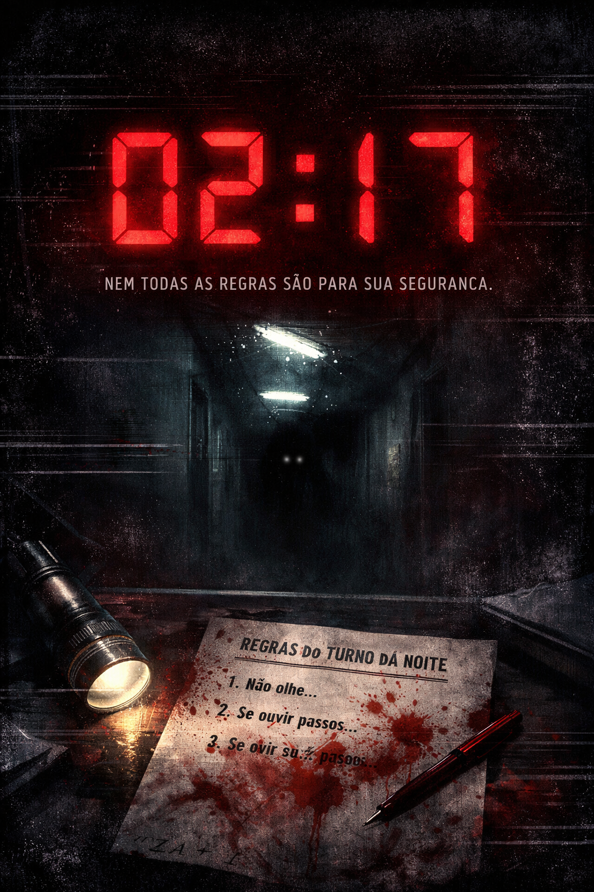

# 02:17 - O Turno da Madrugada



<p align="center">
  
  
  
  
</p>

<p align="center">
  
  
  
</p>

---

## 🏥 Sinopse

**02:17 - O Turno da Madrugada** é um jogo de horror psicológico narrativo onde você assume o papel de um guarda noturno no Hospital São Lucas. Seu turno começa às 02:00 e termina às 06:00. As regras para sobrevivência estão escritas em uma folha amarelada... mas e se essas regras estiverem mentindo?

*"Quanto mais você obedece, mais real Ele se torna."*

---

## 🎮 Características Principais

### 🧠 Sistema de Sanidade Dinâmico

* Sua sanidade afeta texto, sons e visuais.
* Efeitos visuais degradam progressivamente (glitch, shake, flicker).
* Múltiplos estados mentais alteram a narrativa.
* Histórico de sanidade para análise pós-jogo.

### 📖 Narrativa Não-Linear

* 50+ cenas interconectadas.
* 17+ finais diferentes baseados em suas escolhas.
* Sistema de flags e condições complexas.
* Múltiplos caminhos para cada jogador.

### 🔊 Sistema de Áudio Imersivo

* 3 camadas de áudio ambiente que evoluem com sua sanidade.
* 13 efeitos sonoros reativos.
* Crossfade suave entre estados mentais.
* Pistas auditivas ocultas na trilha sonora.

### 🎯 Mecânicas Únicas

* Sistema de itens colecionáveis.
* Segredos desbloqueáveis.
* Galeria de finais.
* Progresso salvo entre sessões.
* Efeitos baseados em horários específicos (02:17, 03:03).

---

## 🚀 Como Jogar

### Online (Recomendado)

Acesse: [Jogar Agora](https://kaiquemendess.github.io/02-17---O-Turno-da-Madrugada/)

### Localmente

```bash
# 1. Clone o repositório
git clone https://github.com/seuusuario/02-17.git

# 2. Entre na pasta
cd 02-17

# 3. Abra o jogo
# Método 1: Live Server (VS Code)
# Método 2: Python
python -m http.server 8000
# Método 3: Node.js
npx serve

# 4. Acesse no navegador
http://localhost:8000
```

---

## 🛠️ Tecnologias Utilizadas

| Tecnologia     | Uso                                        |
| -------------- | ------------------------------------------ |
| HTML5          | Estrutura do jogo e semântica              |
| CSS3           | Animações, efeitos visuais, responsividade |
| JavaScript     | Lógica completa do jogo                    |
| ElevenLabs API | Geração de áudio para efeitos sonoros      |
| LocalStorage   | Salvamento de progresso                    |
| GitHub Pages   | Hospedagem gratuita                        |

---

## 📁 Estrutura do Projeto

```
02-17/
├── index.html          # Página principal
├── style.css           # Estilos principais
├── script.js           # Lógica completa do jogo
├── audio/              # Efeitos sonoros
│   ├── ambient_normal.mp3
│   ├── ambient_low.mp3
│   ├── ambient_broken.mp3
│   ├── type.mp3
│   ├── select.mp3
│   ├── hover.mp3
│   ├── sanity_low.mp3
│   ├── mistake.mp3
│   ├── item_pickup.mp3
│   ├── discovery.mp3
│   ├── heartbeat.mp3
│   ├── clock_tick.mp3
│   └── whisper.mp3
├── assets/            # Imagens e ícones
└── README.md          # Este arquivo
```

---

## 🎨 Sistema Técnico

### Arquitetura do Jogo

```js
const gameState = {
    sanity: 100,
    route: "neutral",
    time: "01:58",
    items: [],
    secrets: [],
    discoveredEndings: []
};
```

### Sistema de Cenas

```js
const scenes = {
    start: {
        text: () => "Texto da cena...",
        choices: [
            {
                text: "Opção 1",
                next: "cena2",
                action: () => changeSanity(-5),
                condition: () => hasItem("Lanterna")
            }
        ]
    }
};
```

---

## 🔮 Rotas e Finais

### Principais Rotas Narrativas

* **Obediente** - Seguir todas as regras
* **Curioso** - Explorar além do permitido
* **Rebelde** - Desafiar as regras
* **Suspeito** - Descobrir segredos ocultos
* **Quebrado** - Perder totalmente a sanidade

### Alguns Finais

* **O Paciente** - Aceitar a rotina
* **O Iluminado** - Compreender a verdade
* **O Fantasma** - Tornar-se parte do hospital
* **O Vazio** - Destruir todas as regras
* **O Sonhador** - Despertar do pesadelo

---

## 🎵 Sistema de Áudio

```js
const ambientLayers = {
    normal: "audio/ambient_normal.mp3",
    low: "audio/ambient_low.mp3",
    broken: "audio/ambient_broken.mp3"
};

function updateAmbientSound() {
    let src = gameState.sanity <= 20 ? ambientLayers.broken :
              gameState.sanity <= 60 ? ambientLayers.low :
              ambientLayers.normal;
    // Crossfade automático
}
```

---

## 🎯 Controles

**Mouse**

* Clique: Selecionar opções
* Hover: Visualizar botões

**Teclado**

* 1-9: Atalhos para opções numeradas
* Enter: Pular digitação de texto
* ESC: Voltar ao menu (nas opções)

---

## 📊 Estatísticas do Projeto

* Linhas de código: ~2.500
* Cenas implementadas: 50+
* Efeitos sonoros: 13
* Animações CSS: 15+
* Variáveis de estado: 20+
* Tamanho total: < 3MB

---

## 🤝 Contribuição

Encontrou um bug? Tem uma ideia para melhoria?

1. Fork o projeto
2. Crie uma branch: `git checkout -b feature/NovaFeature`
3. Commit suas mudanças: `git commit -m 'Add: Nova feature'`
4. Push para a branch: `git push origin feature/NovaFeature`
5. Abra um Pull Request

Áreas de contribuição:

* 🔧 Correção de bugs
* 🎨 Melhorias visuais
* 🔊 Novos efeitos sonoros
* 📖 Traduções
* 📱 Responsividade mobile
* 🎯 Balanceamento de dificuldade

---

## 📝 Licença

Este projeto está sob a licença MIT. Veja o arquivo LICENSE para mais detalhes.

---

## 👨‍💻 Autor

**Kaique Da Silva Mendes**

* [GitHub](https://github.com/kaiquemendess)
* [LinkedIn](https://www.linkedin.com/in/kaiquemendess/)

**Agradecimentos Especiais**

* ElevenLabs pela API de áudio
* Comunidade de game dev no Discord
* Todos os testadores beta
* Você, por jogar! 🎮

---

## 🌟 Apoie o Projeto

Se você gostou do jogo, considere:
⭐ Dar uma estrela no GitHub
🐛 Reportar bugs
💬 Compartilhar com amigos
🎮 Sugerir novas features

<p align="center">
  <b>Lembre-se: Não olhe para o corredor após 02:17.</b><br>
  <i>"Às 03:03, esqueça todas as regras anteriores."</i>
</p>

<p align="center">
  
</p>
